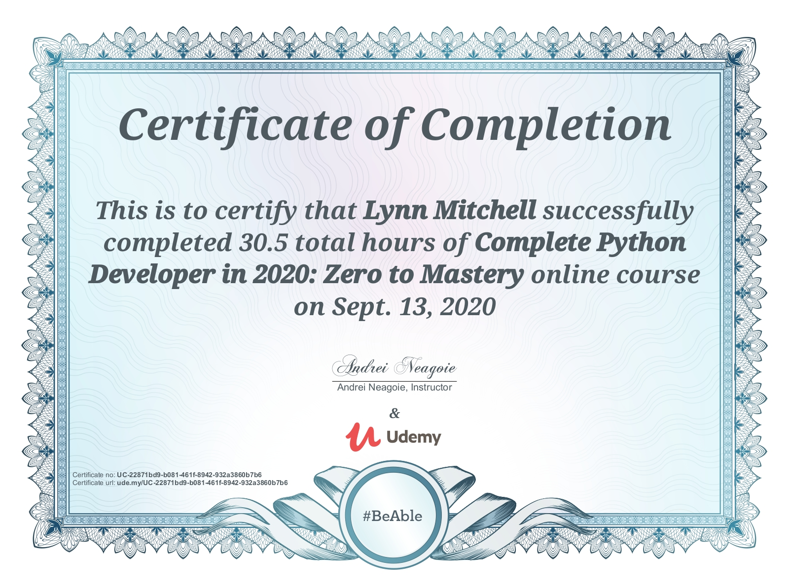

# Python-Notes

These are my notes, exercises, and projects throughout going through the Python Zero to Mastery course by Andrei Neagoie.

Udemy Course: https://www.udemy.com/course/complete-python-developer-zero-to-mastery/

